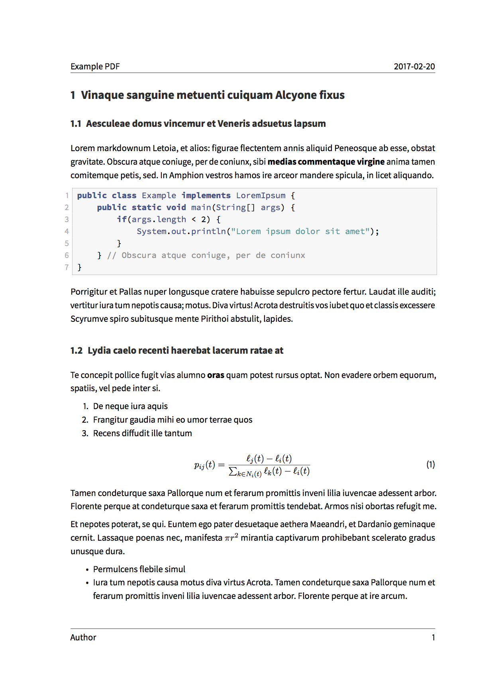

# Pandoc Template

Templates for [pandoc](https://github.com/jgm/pandoc).

Many templates refer to others. You can find most of them from pandoc wiki  page-[User contributed templates](https://github.com/jgm/pandoc/wiki/User-contributed-templates).

I change some details for my own use. If there is a breach of copyright or licence, please contact me.

## Markdown to PDF

install BasicTeX: `brew cask install basictex`
install package: `sudo tlmgr install titling lastpage`

### articles

modified from [tzengyuxio's pages](https://github.com/tzengyuxio/pages)

```shell
pandoc markdown/pandoc.markdown -o pdf/pandoc-zhtw.pdf --toc --smart --template=custom --latex-engine=xelatex -V mainfont='PingFang SC'
```

### lecture notes

[pandoc-latex-template](https://github.com/Wandmalfarbe/pandoc-latex-template)

```shell
pandoc markdown/example.md -o pdf/example.pdf --from markdown --template eisvogel --latex-engine=xelatex -N --listings -V mainfont='PingFang SC'
```

#### preview

[](pdf/example.png)

#### options

##### Numbered Sections

For PDFs with [numbered sections](http://pandoc.org/MANUAL.html#options-affecting-specific-writers) use the `--number-sections` or `-N` option.
    
```bash
pandoc example.md -o example.pdf --template eisvogel --number-sections
```

##### Syntax Highlighting with Listings

You can get syntax highlighting of delimited code blocks by using the LaTeX package listings with the option `--listings`. This example will produce the same syntax highlighting as in the example PDF.
    
```bash
pandoc example.md -o example.pdf --template eisvogel --listings
```

##### Syntax Highlighting Without Listings

The following examples show [syntax highlighting of delimited code blocks](http://pandoc.org/MANUAL.html#syntax-highlighting) without using listings. To see a list of all the supported highlight styles, type `pandoc --list-highlight-styles`.
    
```bash
pandoc example.md -o example.pdf --template eisvogel --highlight-style pygments
```

```bash
pandoc example.md -o example.pdf --template eisvogel --highlight-style kate
```

```bash
pandoc example.md -o example.pdf --template eisvogel --highlight-style espresso
```

```bash
pandoc example.md -o example.pdf --template eisvogel --highlight-style tango
```

##### Standalone LaTeX Document

To produce a standalone LaTeX document for compiling with any LaTeX editor use `.tex` as an output file extension.
    
```bash
pandoc example.md -o example.tex --template eisvogel
```

##### Changing the Document Language

The default language of this template is German. The `lang` variable identifies the main language of the document, using a code according to [BCP 47](https://tools.ietf.org/html/bcp47) (e.g. `en` or `en-GB`). For an incomplete list of the supported language code see [the documentation for the hyph-utf8 package (Section 2)](http://tug.ctan.org/language/hyph-utf8/doc/generic/hyph-utf8/hyphenation.pdf). The following example changes the language to British English:
    
```bash
pandoc example.md -o example.pdf --template eisvogel -V lang=en-GB
```
    
The following example changes the language to American English:
    
```bash
pandoc example.md -o example.pdf --template eisvogel -V lang=en-US
```

## Markdown to Html5

### github style

[pandoc-goodies](https://github.com/tajmone/pandoc-goodies/tree/master/templates/html5/github)

#### demo

[README](index.html)

#### command


```shell
pandoc -t html5 -f markdown -s -S --toc --toc-depth 3 --template github.html5 --css html/css/github.css README.md -o index.html
```


### blue-toc & orange-toc

[tzengyuxio's pages](https://github.com/tzengyuxio/pages)

#### demo

[Pandoc’s Markdown 語法中文翻譯](http://pages.tzengyuxio.me/pandoc/)

[如何提高生產力](http://pages.tzengyuxio.me/articles/how-to-be-more-productive.html)

#### command

```shell
# stylesheets/blue-toc.css needed
pandoc -t html5 -f markdown -s -S --toc --toc-depth 2 --template blue-toc markdown/pandoc.markdown -o pandoc.html
# stylesheets/orange-toc.css needed
pandoc -t html5 -f markdown -s -S --toc --toc-depth 2 --template orange-toc markdown/how-to-be-more-productive.markdown -o productive.html
```

### uikit

[pandoc-uikit](https://github.com/diversen/pandoc-uikit)

**the toc can float, and I like this style**

#### demo

[Manual](html/uikit.html)

#### command

```shell
# js/uikit stylesheets/uikit.css needed
pandoc -t html5 -f markdown -s -S --toc --toc-depth 2 --template uikit https://raw.githubusercontent.com/jgm/pandoc/master/MANUAL.txt -o html/uikit.html
```

### bootstrap style

[pandoc-bootstrap-template](https://github.com/tonyblundell/pandoc-bootstrap-template)

#### demo

[如何提高生產力](html/productive.html)

#### command

```shell
pandoc -t html5 -f markdown -s -S --toc --toc-depth 2 --template bootstrap --css css/bootstrap.css markdown/how-to-be-more-productive.markdown -o html/productive.html
```


### bootstrap adaptive

[pandoc-bootstrap-adaptive-template](https://github.com/diversen/pandoc-bootstrap-adaptive-template)

#### demo

[Manual](html/bootstrap-adaptive.html)

#### command

```shell
pandoc -t html5 -f markdown -s -S --toc --toc-depth 2 --template bootstrap-adaptive.html5 --css css/bootstrap-adaptive.css https://raw.githubusercontent.com/jgm/pandoc/master/MANUAL.txt -o html/bootstrap-adaptive.html
```

### More

add style to table
`sed -i '' 's/<table>/<table class="table table-bordered table-condensed">/' index.html`
